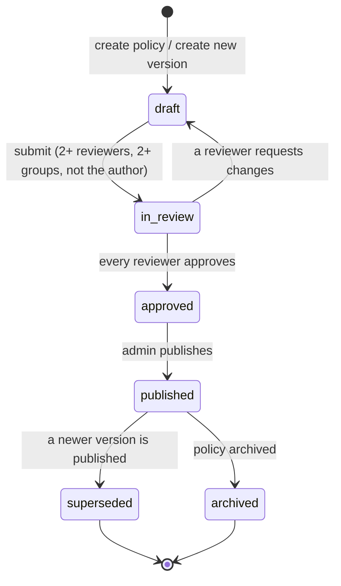

# Policy Management, Assignment and Acknowledgement Module

Owner: **Sanduni (Member 2)**. Branch: `sanduni`. Server code: `server/modules/policy/`. Browser code: `public/js/policy/` and `public/css/policy.css`. Tests: `tests/policy.test.js`.

The module turns Biztat's written security policies into something the organisation can manage and prove. Policies are drafted, reviewed by IT and non-IT reviewers, published as immutable versions, assigned to the right people, read, and acknowledged against a fingerprint of the exact text.

## 1. Pages

| Route | Who | Purpose |
| --- | --- | --- |
| `#/policies` | Everyone | My policies inbox: Action required, Overdue, Acknowledged, All company policies; search, category filter, privacy notice |
| `#/policies/:slug` | Assigned users, or everyone for "visible to all" | Reader: table of contents, reading progress, What changed callout, print/PDF, acknowledgement panel, questions, exception request |
| `#/policies/:slug/v/:label` | Admins; reviewers of that version | Read a specific (draft, superseded) version |
| `#/policies/receipts`, `#/policies/receipts/:code` | Holder and admins | My acknowledgements and the printable receipt; personal CSV download |
| `#/policies/reviews` | Anyone named as a reviewer | Review queue: Approve or Request changes with a comment |
| `#/policies/team` | Department Manager (own department), admins | Team status and Send reminder |
| `#/policies/admin` | Security/HR Admin, System Admin | Policy library with status, category, owner and "review due in 30 days" filters |
| `#/policies/admin/new`, `#/policies/admin/versions/:id` | Admins | Editor with live preview, Save draft, Submit for review (reviewer picker), Publish |
| `#/policies/:slug/history` | Admins | Version timeline, Create new version, Archive |
| `#/policies/:slug/compare?from=&to=` | Admins | Side-by-side or inline line diff |
| `#/policies/admin/assignments` | Admins | Assign to department, role or user with a recipient preview |
| `#/policies/admin/compliance` | Admins | Status by policy, department and person; evidence table; CSV export |
| `#/policies/admin/calendar` | Admins | Review calendar (overdue, due in 30 days, later) |
| `#/policies/admin/questions`, `#/policies/admin/exceptions` | Admins | Answer questions; approve or reject time-limited exceptions |
| `#/policies/research` | Admins | Research basis and standards alignment |

## 2. API reference

All routes are under `/api/policy/`, behind the foundation's session check (401) and, for every non-GET request, the CSRF check (403). The acting user always comes from the session. Admin = Security/HR Admin or System Admin.

| Method and path | Role | Result |
| --- | --- | --- |
| `GET /policies` | any | Inbox items with status, due date and reading time |
| `GET /policies/:slug`, `GET /policies/:slug/versions/:label` | readers allowed by `canRead` | Version, state, reading state, attestation text, answered Q&A, own questions and exceptions; 404 otherwise |
| `POST /versions/:id/read` `{event: "open" \| "end"}` | readers | Records first open; accepts "end" only after the minimum reading time (409 with `secondsRemaining`) |
| `POST /policies/:slug/acknowledge` `{versionId, attest, typedFullName}` | assigned or visible-to-all | 201 receipt; 200 existing receipt; 400 superseded version, unticked box or wrong name; 403 not assigned or not read to end |
| `GET /receipts/:code` | holder, admins | Receipt; 404 for anyone else |
| `GET /me/acknowledgements`, `GET /me/acknowledgements.csv` | any (own data only) | Personal record and data-subject export |
| `POST /policies/:slug/questions`, `POST /policies/:slug/exceptions` | readers | Question to the owner; exception request (one pending per policy) |
| `GET /reviews`, `POST /reviews/:versionId/decision` | reviewers | Queue; `approved` or `changes_requested` (comment required); 403 for the author or non-reviewers |
| `GET /admin/policies`, `POST /admin/policies` | admin | Library; create policy with a draft v1.0 |
| `GET /admin/versions/:id`, `PUT /admin/versions/:id` | admin | Editor data; edit a **draft** only (409 with `action: "create_new_version"` otherwise) |
| `POST /admin/policies/:slug/versions` `{versionLabel, changeSummary, requiresReacknowledgement}` | admin | New draft copied from the current published version |
| `POST /admin/versions/:id/submit` `{reviewers: [{userId, group}]}` | admin | 2–6 reviewers from at least 2 groups, never the author |
| `POST /admin/versions/:id/publish` | admin | Only when every reviewer approved (409 otherwise); supersedes the previous version and notifies recipients |
| `POST /admin/policies/:slug/archive` | admin | Withdraws the policy; evidence is kept |
| `GET /admin/policies/:slug/history`, `GET /admin/policies/:slug/compare?from&to` | admin | Timeline; line diff as `{type, text}` data |
| `GET/POST /admin/assignments`, `POST /admin/assignments/preview`, `DELETE /admin/assignments/:id` | admin | Assignments; only policies with a published version (400 otherwise) |
| `GET /admin/compliance`, `GET /admin/evidence`, `GET /admin/evidence.csv`, `GET /admin/calendar` | admin | Compliance, evidence, formula-safe CSV, review calendar |
| `GET /team`, `GET /team/users/:id`, `POST /team/reminders` | manager (own department), admin | Team status; 404 for other departments; reminders throttled to one per 10 minutes |
| `GET/POST /admin/questions…`, `GET/POST /admin/exceptions…` | admin | Answer questions; decide exceptions (expiry required, max 365 days, not your own request) |

## 3. Data model

```text
policies (slug, title, category, owner_user_id, visibility, current_version_id, archived_at)
  └─ policy_versions (version_label, status, summary, body_markdown, change_summary,
                      requires_reacknowledgement, effective_date, next_review_date,
                      content_sha256, created_by, published_at, published_by, superseded_at)
       ├─ policy_reviews (reviewer_user_id, reviewer_group, decision, comment, decided_at)
       ├─ policy_read_events (user_id, first_opened_at, reached_end_at, seconds_open)
       ├─ policy_acknowledgements (receipt_code, user_id, statement_text, typed_full_name,
       │                           content_sha256, acknowledged_at, user_agent_family)
       └─ policy_questions (asked_by, question, answer, answered_by)
policies ─ policy_assignments (target_type department|role|user, target_value, due_in_days, due_date)
policies ─ policy_exceptions (requested_by, justification, status, decided_by, expires_at)
```

Migrations use `CREATE TABLE IF NOT EXISTS` and run at every start-up. All SQL is parameterised.

## 4. Policy life cycle



- Only `draft` text can be edited. Everything else is fixed, because people may have acknowledged it.
- Publishing a version with `requires_reacknowledgement` moves every assigned user to **Re-acknowledge**, with a fresh deadline of `due_in_days` from publication. A minor version without re-acknowledgement keeps existing acknowledgements valid.

## 5. Compliance status rule (`store.statusFor`)

1. **complete**: the user acknowledged the current version, or a version published after the latest version that required re-acknowledgement.
2. **exempt**: an approved exception that has not expired.
3. **optional**: not assigned, visible to all, not acknowledged (shown for information, not counted).
4. **overdue**: assigned, not complete, past the due date.
5. **needs_reack**: acknowledged an older version that no longer counts, still within the deadline.
6. **pending**: otherwise.

## 6. Acknowledgement evidence

An acknowledgement is accepted only when the version is published and current, the policy is assigned to the user or visible to all, the server recorded that the reader reached the end (after a minimum reading time that scales with length), the attestation box is ticked, and the typed name matches the account name (case and spacing ignored). The server stores its own version id, statement and the SHA-256 of the exact markdown shown, and returns a receipt `PA-XXXX-XXXX-XXXX-XXXX`. Repeating the request returns the same receipt.

## 7. Privacy and retention

- Stored: user, version, time, statement, typed name, content hash, read times and browser family. Not stored: IP address or full user-agent.
- Managers see status for their own department only; receipts are private to the holder and admins; public Q&A does not name the asker.
- Employees can download their own record (`/me/acknowledgements.csv`).
- Retention: `POLICY_EVIDENCE_RETENTION_YEARS = 6` after a version is superseded or archived, purged at start-up and audited (`server/modules/policy/retention.js`).

## 8. Standards alignment and sources

Alignment, not certification. Checked on 2026-10-01.

| Source | How the module uses it |
| --- | --- |
| [ISO/IEC 27001:2022](https://www.iso.org/standard/27001) Annex A 5.1 | Defined (editor), approved (multi-group review), published (immutable versions), communicated (assignments), acknowledged (receipts), reviewed at planned intervals (review calendar, new versions) |
| [ISO/IEC 27002:2022](https://www.iso.org/standard/75652.html) control 5.1 | Top-level plus topic-specific policies; review on change |
| [NIST CSF 2.0](https://www.nist.gov/cyberframework) GV.PO-01, GV.PO-02 | Policy established, communicated, enforced, reviewed and updated |
| [NIST SP 800-53 Rev. 5 PL-4](https://csrc.nist.gov/pubs/sp/800/53/r5/upd1/final) | Documented acknowledgement of rules of behaviour; re-acknowledgement on revision |
| [NIST SP 800-12 Rev. 1](https://csrc.nist.gov/pubs/sp/800/12/r1/final) | Awareness of rules as part of the security programme |
| [NIST SP 800-63B-4](https://pages.nist.gov/800-63-4/sp800-63b.html) | Password and Authentication Policy (15+ characters, no composition rules, no forced rotation, blocklist, MFA) |
| [NIST SP 800-61 Rev. 3](https://csrc.nist.gov/pubs/sp/800/61/r3/final) | Incident Reporting Policy |
| [NIST SP 800-46 Rev. 2](https://csrc.nist.gov/pubs/sp/800/46/r2/final), [SP 800-124 Rev. 2](https://csrc.nist.gov/pubs/sp/800/124/r2/final) | Remote Work and BYOD policies |
| [NIST SP 800-88 Rev. 2](https://csrc.nist.gov/pubs/sp/800/88/r2/final) | Media disposal in the Data Classification Policy |
| [PDPA No. 9 of 2022](https://www.parliament.lk/uploads/acts/gbills/english/6242.pdf), [Gazette 2498/16](https://documents.gov.lk/view/egz/2026/7/2498-16_E.pdf), [DPA](https://www.dpa.gov.lk/) | Data Classification Policy; Parts I and III operate from 1 January 2027; privacy design of the module |

## 9. Seeded content

| Policy | Versions | Audience |
| --- | --- | --- |
| Information Security Policy | 1.0 | All staff (also visible to all) |
| Acceptable Use Policy | 1.0 (superseded), 1.1 (requires re-acknowledgement) | All staff |
| Password and Authentication Policy | 1.0 | All staff |
| Data Classification and Handling Policy | 1.0 | Consulting, Development |
| Remote and Hybrid Work Security Policy | 1.0 (review overdue) | Consulting, Development |
| Information Security Incident Reporting Policy | 1.0 | All staff |
| Clean Desk and Clear Screen Policy | 1.0 | Visible to all |
| BYOD Policy | 1.0 in review (IT approved, Management pending) | Assigned after publication |
